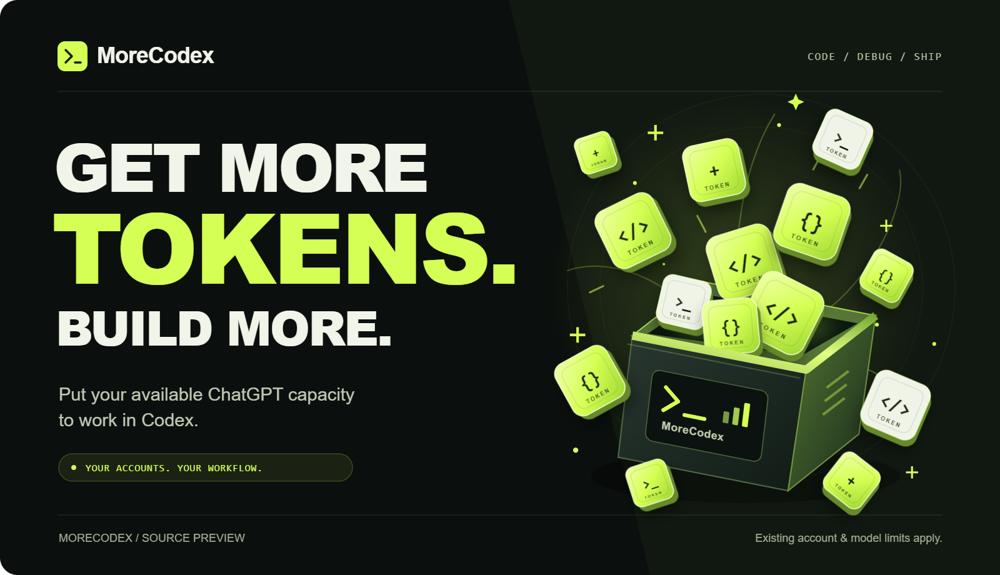

# MoreCodex

**GET MORE TOKENS. BUILD MORE.**

Put your available ChatGPT capacity to work in Codex.



[简体中文](README.zh-CN.md) · [Why MoreCodex](#why-morecodex) · [Compare with upstream](#morecodex-vs-codex-chatgpt-web) · [Account setup](docs/web-accounts.md) · [Preview status](docs/preview-status.md) · [Contributing](CONTRIBUTING.md)

MoreCodex brings supported ChatGPT Web models into your local Codex workflow. Put available usage from accounts you control to work on coding, debugging, code review and documentation, with local tools available through a configured connector.

**The benefit: more usable AI capacity in Codex.** When an eligible ChatGPT account and model still have capacity, MoreCodex gives you a way to use that access for development in Codex. You get more choice about where your next task runs and more value from the access you already have.

**Why choose MoreCodex?** Keep multiple accounts ready, see which account each model belongs to, and choose the configured account/model for your next task. MoreCodex builds on codex-chatgpt-web with account management and Windows deployment and recovery helpers for people who want more control over their setup.

*Tibo, pretty please give us a Codex RESET! 🙏*

## Why MoreCodex

| Benefit | What it means for your work |
| --- | --- |
| **Make more of your available usage** | Use eligible ChatGPT Web access for tasks in Codex. An additional usable account/model route can give you capacity for more work. |
| **Keep work moving** | When your usual route reaches a limit, you can explicitly choose another configured route that remains usable for your next task. |
| **Choose from more models** | Bring supported, verified Web models into Codex's model catalogue, with account labels that make the choices clear. |
| **Turn conversations into action** | With full tool mode configured, compatible Web models can inspect files, edit code and run commands through authorized local tools. |
| **Manage accounts in one place** | Keep accounts enrolled with independent persistent sessions and configuration, without repeatedly replacing the desktop's main login. |
| **Know what is running your task** | Account, workspace and model checks help ensure that a request uses your selected binding. A mismatch returns an error. |

This is especially useful when you already have eligible ChatGPT access you want to use for development, work across several accounts you control, or want to try different supported models on the same local project.

## MoreCodex vs. codex-chatgpt-web

The original [codex-chatgpt-web](https://github.com/miuuyy/codex-chatgpt-web) provides the Web-to-Codex bridge, streaming and local tool connection. MoreCodex builds on that foundation. The comparison below describes additions to the [v5.0.6 source snapshot we imported](https://github.com/miuuyy/codex-chatgpt-web/tree/e85e3693fdb4e3e033348c08df0298c20fcdb612); later upstream releases may differ.

| Workflow | Upstream v5.0.6 baseline | What MoreCodex adds for you |
| --- | --- | --- |
| **Keep multiple accounts ready** | A configured browser host and session for the bridge. | Enroll multiple accounts with independent configuration and saved Web sessions. Keep eligible accounts available without repeatedly replacing the desktop's main login. |
| **Choose the account behind a model** | Shared ChatGPT Web model presets and catalogue metadata. | Account-labelled entries from enrolled catalogues, plus configurable model definitions. Distinguish the same model across accounts and select the binding you intend to use. |
| **Check the account and workspace** | Browser and model checks for the configured session. | Bind requests to the enrolled account, workspace and model; reject mismatches and missing per-account tool settings. Make the selected account part of request validation. |
| **Manage an existing Windows installation** | Launcher lifecycle and installation tooling. | Additional manifest checks, deployment backups, rollback and startup/route ownership helpers. Review a runtime change and keep a defined path back to the previous setup. |

**Choose this preview when you want several accounts and their models available in one Codex workflow, with explicit control over where each new task runs.** Account setup is currently CLI-based, and every account/model needs a real request to verify it. The Windows helpers require an existing managed installation. See the [account guide](docs/web-accounts.md), [deployment helper](scripts/deploy-current-runtime.cjs) and [preview status](docs/preview-status.md) for setup and current coverage.

## How you can get more work done

For example, suppose your usual Codex route has reached its limit, while an enrolled ChatGPT Web model is still available for use. After configuring and verifying that route, select its labelled model in Codex and start your next task in the same project: review a change, investigate a bug, or write documentation. That available access can now support work in your Codex workflow.

You choose the account and model explicitly. Switching routes does not automatically transfer an in-progress conversation between accounts. See the [account guide](docs/web-accounts.md) for setup and verification.

**How usage works:** MoreCodex makes existing eligible capacity usable through additional routes; it does not increase an account's official quota, pool limits or promise a fixed multiplier. Actual capacity depends on the selected account, model and service. Some services share limits: OpenAI documents shared usage for ChatGPT Work and Codex in its [official usage guidance](https://learn.chatgpt.com/docs/pricing). Check your account's current limits rather than assuming every route adds a separate allowance.

## Run the development launcher

**v0.1.0-preview is a source preview for developers and early testers.** This release includes source and build tooling; a MoreCodex binary installer is not yet published. Browser reconnection, connector selection and long-session recovery still have acceptance gaps; see [preview status](docs/preview-status.md) for the verified scope.

This source path requires Bun 1.4.0. Install Git and that exact Bun version first, then run:

```sh
git clone https://github.com/howard-lynn-ye/MoreCodex.git
cd MoreCodex
bun run app
```

The command installs locked dependencies and opens a separate development profile. It is not a production installation into your existing Codex setup. Advanced configuration is described in the [account guide](docs/web-accounts.md).

To build a desktop package locally on its matching operating system:

```sh
bun install --frozen-lockfile
cd launcher
bun install --frozen-lockfile
cd ..
bun run app:package
```

Successful builds place artifacts in `launcher/artifacts/`. Build tooling is inherited from upstream; this preview does not claim verified packages on every platform. The inherited download installers and in-app binary updater are not the installation path for this source-only release.

## Accounts and local tools

The Web path uses an authenticated browser session. The local HTTP endpoint connects that session to Codex; each account retains its own authentication and permissions.

Start with an account you control and complete its sign-in yourself. Full tool access also requires a working connector and Tunnel for that same account/workspace. Test a real request, then a small tool operation, before using the account for a larger task. Browser-only mode does not provide the full local tool flow.

Existing Chrome/Edge attachment is experimental and requires browser-provided connection approval. Bridge or browser restarts may require approval again. Do not run two bridges against the same Codex configuration or copy browser profiles between installations.

MoreCodex uses `.morecodex` / `.morecodex-dev` as default bridge homes and `MoreCodex` as its production launcher data directory. The legacy `CODEX_CHATGPT_WEB_*` and `CODEX_WEB_GPT_*` environment variables, `codex-chatgpt-web` CLI alias, and `chatgpt-web/...` model routes remain for protocol compatibility. Custom paths can still be selected explicitly.

## Development and verification

```sh
bun run check-version
bun run typecheck
bun run launcher:typecheck
bun run launcher:build
```

Preview CI runs these checks and focused offline tests for accounts, model selection, browser ownership and Windows integration. The full inherited validation and binary release workflows remain available as manual workflows. Live account, browser, MCP and reboot acceptance is separate from offline tests; see [preview status](docs/preview-status.md).

## Privacy and provenance

Keep cookies, tokens, account registries, browser profiles and raw diagnostics out of Git. Review any file before attaching it to an issue. MoreCodex is independent and is not affiliated with or endorsed by OpenAI.

The original bridge and launcher were created by **miuuyy and codex-chatgpt-web contributors**. This repository starts from a source snapshot based on `e85e3693fdb4e3e033348c08df0298c20fcdb612` (v5.0.6), retains the original [MIT license](LICENSE), and records MoreCodex additions in [CHANGELOG.md](CHANGELOG.md). Earlier upstream history is available in the original repository. See [UPSTREAM.md](UPSTREAM.md) for attribution and the comparison baseline.
