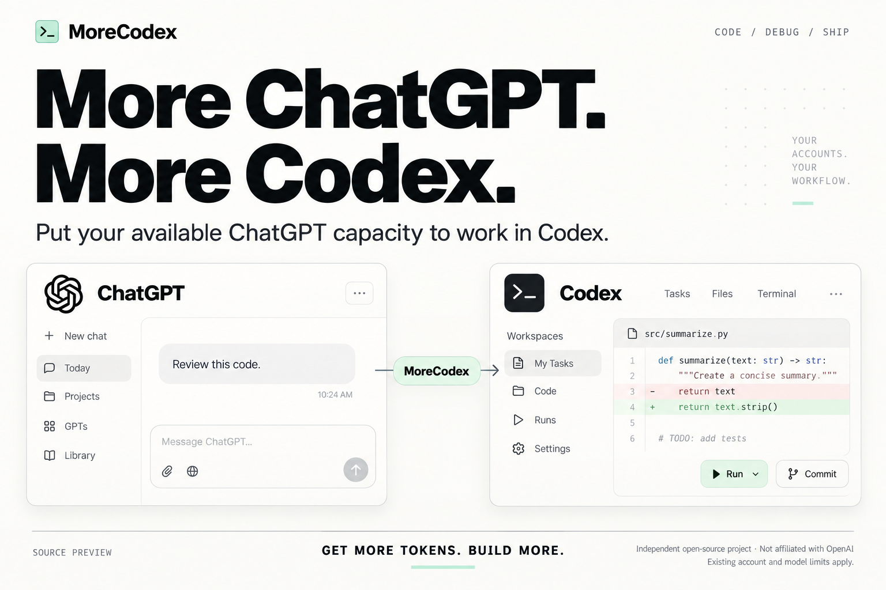

# MoreCodex

**GET MORE TOKENS. BUILD MORE.**

用好已有的 ChatGPT 可用额度，让 Codex 火力全开。

**为编程 Agent 的工作流而设计，让你的 Agent 替你安装 MoreCodex。** 把这个仓库交给能使用本地终端的 Agent，直接复制[下方安装提示词](#让你的-agent-替你安装-morecodex)。



[English](README.md) · [让 Agent 安装](#让你的-agent-替你安装-morecodex) · [为什么使用 MoreCodex](#为什么使用-morecodex) · [与原项目对比](#morecodex-与-codex-chatgpt-web-的区别) · [账号配置](docs/web-accounts.md) · [预览版状态](docs/preview-status.md)

MoreCodex 将受支持的 ChatGPT 网页模型接入本地 Codex，让你把自己账号中仍可使用的额度用于编程、排查问题、代码审查和文档编写；配置好连接器后，还能调用授权的本地工具。

**核心收益：让 Codex 能利用更多已有的可用额度，完成更多工作。** 当你有权限使用的 ChatGPT 账号和模型仍有余量时，MoreCodex 提供了一条在 Codex 中使用这些资源的途径，让下一项任务有更多选择，也让已有的访问权限发挥更大价值。

**为什么选择 MoreCodex？** 同时配置好多个账号，看清每个模型对应哪个账号，再为下一项任务选择要使用的账号和模型。MoreCodex 在 codex-chatgpt-web 的基础上增加账号管理，以及 Windows 部署和恢复工具，适合希望更灵活地管理自己配置的用户。

*求求了 TIBO 给个 RESET 吧！🙏*

## 让你的 Agent 替你安装 MoreCodex

MoreCodex 面向本地编程 Agent 的工作流。你的 Agent 可以阅读安装指南、检查环境、准备依赖，并替你启动源码预览版。**把下面这段话直接发给你的编程 Agent：**

```text
请帮我安装和配置 MoreCodex：https://github.com/howard-lynn-ye/MoreCodex。
先阅读 README.zh-CN.md、docs/agent-install.md 和 docs/preview-status.md。
检查我的操作系统和现有环境，使用项目要求的 Bun 版本，
通过本地终端按文档完成源码预览版的安装步骤。
保留我现有的 Codex 配置和本地工作。
再按照 docs/web-accounts.md 帮我配置有权限使用的账号和模型；
账号登录以及浏览器、连接器授权由我本人完成。
验证启动器正常运行；配置完成后，再验证一次真实模型回复和一次
已授权的本地工具操作。告诉我哪些步骤已成功、还缺什么。
不要把凭据、浏览器资料或私有日志提交到 Git，也不要在报告中显示它们。
```

[Agent 安装指南](docs/agent-install.md)提供具体命令和完成检查。当前发布的是源码预览版，先启动独立开发环境，再完成账号登录、连接器授权和真实模型／工具调用验证，就能确认实际任务所需的配置是否就绪。

## 为什么使用 MoreCodex

| 好处 | 对实际工作的帮助 |
| --- | --- |
| **用好已有额度** | 将有权限使用的 ChatGPT 网页模型接入 Codex；新增的可用账号或模型渠道，可以为更多任务提供资源。 |
| **让工作继续推进** | 常用渠道达到上限时，可以手动选择另一个已配置、仍可使用的渠道开展下一项任务。 |
| **获得更多模型选择** | 将受支持且通过校验的网页模型加入 Codex 模型目录，通过账号标签区分不同选择。 |
| **让模型直接参与本地工作** | 完整工具模式配置好后，兼容的网页模型可以通过授权工具检查文件、修改代码和运行命令。 |
| **集中管理多个账号** | 每个账号保留独立的持久会话和配置，减少反复替换桌面主登录的操作。 |
| **明确任务由谁执行** | 请求会校验所选账号、工作区和模型绑定，发现不匹配时明确报错。 |

如果你已有可用于开发的 ChatGPT 访问权限、需要管理多个自己的账号，或者希望在同一个本地项目中尝试不同受支持的模型，这些功能尤其有用。

## MoreCodex 与 codex-chatgpt-web 的区别

原项目 [codex-chatgpt-web](https://github.com/miuuyy/codex-chatgpt-web) 提供了网页模型接入 Codex、流式输出和本地工具连接，MoreCodex 在这些基础上继续扩展。下表对比的是我们采用的 [v5.0.6 源码快照](https://github.com/miuuyy/codex-chatgpt-web/tree/e85e3693fdb4e3e033348c08df0298c20fcdb612)；上游后续版本可能已有变化。

| 使用场景 | 上游 v5.0.6 基线 | MoreCodex 新增功能及实际好处 |
| --- | --- | --- |
| **同时准备好多个账号** | 为桥接配置浏览器和会话。 | 登记多个账号，分别保留配置和网页登录会话，减少反复替换桌面主登录的操作，让有权限使用的账号保持可选。 |
| **选择模型对应的账号** | 共用的 ChatGPT 网页模型预设和目录信息。 | 根据已登记的账号目录生成带账号标签的模型条目，并支持配置模型定义。同名模型也能按账号区分，方便选择实际要使用的绑定。 |
| **核对账号和工作区** | 对已配置会话进行浏览器与模型检查。 | 将请求绑定到已登记的账号、工作区和模型，发现不匹配时明确报错；完整工具模式还会检查各账号的独立工具配置，把账号选择纳入请求校验。 |
| **管理已有的 Windows 安装** | 启动器运行管理和安装工具。 | 增加运行包清单校验、部署备份、回滚，以及启动和路由归属检查；便于检查运行环境改动，并保留恢复到原配置的路径。 |

**如果你希望在同一个 Codex 工作流中使用多个账号及其模型，并明确控制每项新任务交给哪个账号，这个预览版就值得尝试。** 目前账号配置通过命令行完成，每个账号和模型都需要真实请求验证；Windows 管理工具要求已有受管理的安装环境。配置方法和已验证范围见[账号指南](docs/web-accounts.md)、[部署工具](scripts/deploy-current-runtime.cjs)和[预览版状态](docs/preview-status.md)。

## 如何让 Codex 完成更多工作

举个例子：你常用的 Codex 渠道已经达到用量上限，但某个已登记的 ChatGPT 网页模型仍可使用。完成该渠道的配置和验证后，就可以在 Codex 中选择带有对应账号标签的模型，在同一项目里开始下一项任务，例如审查改动、排查报错或补充文档。原本可用的访问权限，就能继续服务于你的 Codex 工作流。

账号和模型由你明确选择；切换渠道不会自动将正在进行的对话转移到另一个账号。具体操作见[账号配置指南](docs/web-accounts.md)。

**额度说明：** MoreCodex 通过额外渠道利用已有的可用资源，不修改官方额度、不合并上限，也不承诺固定增加几倍。实际余量取决于所选账号、模型和服务；部分服务共用额度，例如 OpenAI 的[官方用量说明](https://learn.chatgpt.com/docs/pricing)明确说明 ChatGPT Work 与 Codex 共用用量。请以账号当前显示的额度为准，不要把每个渠道都当成独立的新额度。

## 从源码打开开发界面

**当前 `v0.1.0-preview` 是面向开发者和早期测试者的源码预览版。** 本次提供源码和构建工具，尚未发布 MoreCodex 二进制安装包。部分外部浏览器重连、连接器选择和长会话恢复流程仍有验收缺口，已验证范围见[预览版状态](docs/preview-status.md)。

先安装 Git 和 **Bun 1.4.0**，然后运行：

```sh
git clone https://github.com/howard-lynn-ye/MoreCodex.git
cd MoreCodex
bun run app
```

该命令安装锁定版本的依赖，并打开独立开发环境。它不是向现有主 Codex 安装正式运行包的步骤。高级多账号配置见[账号说明](docs/web-accounts.md)。

自行构建桌面包时，在对应操作系统上运行：

```sh
bun install --frozen-lockfile
cd launcher
bun install --frozen-lockfile
cd ..
bun run app:package
```

构建成功后的文件位于 `launcher/artifacts/`。打包工具继承自上游，不能据此认定本预览版已通过所有平台验收。本次源码版不使用继承的下载安装脚本或应用内二进制更新功能。

## 使用范围

网页推理通过已登录的浏览器会话执行，本地 HTTP 入口负责将该会话接入 Codex；每个账号仍保留自己的认证和权限。

账号由使用者自行登录；完整工具链还需要该账号和工作区的连接器、Tunnel 配置。先验证真实回复，再测试一次小型工具操作。目录里出现模型名称不等于该模型已能完成请求。

已有 Chrome/Edge 会话连接属于实验功能，需要浏览器提供的授权。重启后可能需要再次授权。不要让两个桥接实例同时管理同一份 Codex 配置，也不要复制其他安装的浏览器登录数据。

默认桥接目录为 `.morecodex` 和 `.morecodex-dev`，正式启动器数据目录使用 `MoreCodex`。为了保留协议兼容性，现有环境变量前缀、`codex-chatgpt-web` 命令别名和 `chatgpt-web/...` 模型路由暂时保留；自定义路径仍可明确指定。

## 来源与许可

感谢 **miuuyy 和 codex-chatgpt-web contributors** 提供原始桥接和启动器。本仓库从基于 v5.0.6 的源码快照开始，保留原始 [MIT 许可证](LICENSE)，新增改动见 [CHANGELOG.md](CHANGELOG.md)。更早的上游提交历史可在原项目仓库查阅。这是独立项目，并非 OpenAI 官方产品。[来源说明](UPSTREAM.md)记录了比较基线。

不要提交 Cookie、Token、账号注册表、浏览器资料或未脱敏日志；在 issue 中分享文件前也应检查个人信息。
